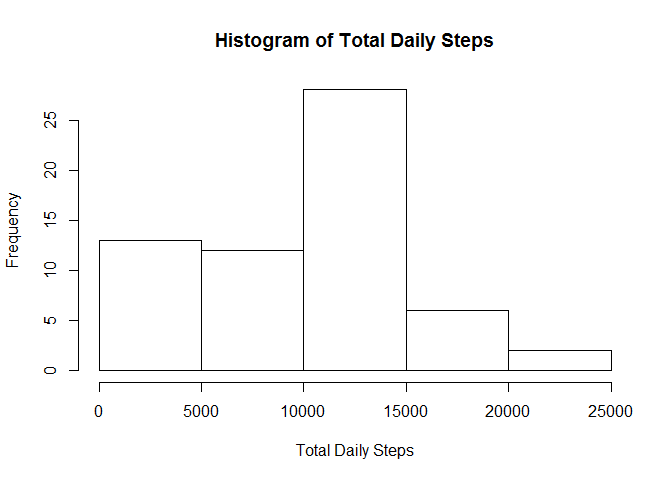
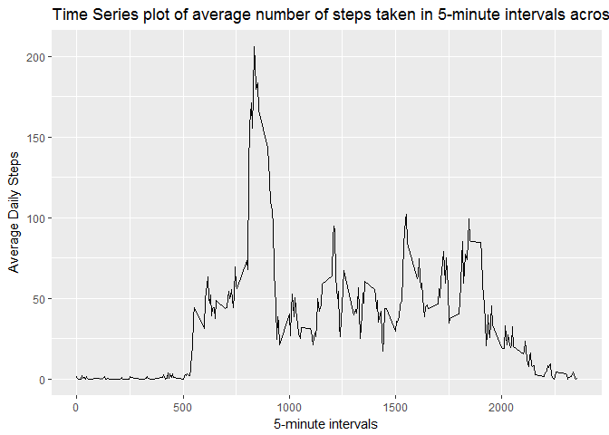
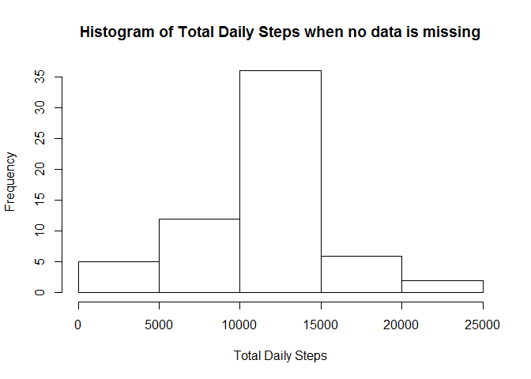
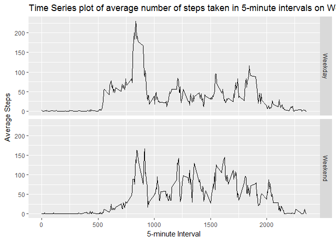

# Reproducible Research: Peer Assessment 1


## Loading and preprocessing the data
###Load the data (i.e. read.csv())

```r
unzip("activity.zip")
data <- read.csv("activity.csv")
```
###Process/transform the data (if necessary) into a format suitable for your analysis

```r
library(dplyr)
```

```
## 
## Attaching package: 'dplyr'
```

```
## The following objects are masked from 'package:stats':
## 
##     filter, lag
```

```
## The following objects are masked from 'package:base':
## 
##     intersect, setdiff, setequal, union
```

```r
data_df <- tbl_df(data)
```
## What is mean total number of steps taken per day?

###Calculate the total number of steps taken per day

```r
daily <- summarise(group_by(data_df,date), steps = sum(steps, na.rm = TRUE))
```
###Make a histogram of the total number of steps taken each day

```r
hist(daily$steps, xlab = "Total Daily Steps", main = "Histogram of Total Daily Steps")
```

<!-- -->

###Calculate and report the mean and median of the total number of steps taken per day

```r
daily_mean <- mean(daily$steps)
daily_median <- median(daily$steps)
```
- The mean of the total number of steps taken per day is **9354.2295082**.
- The median of the total number of steps taken per day is **10395**.

## What is the average daily activity pattern?

###Make a time series plot (i.e. type = "l") of the 5-minute interval (x-axis) and the average number of steps taken, averaged across all days (y-axis)

```r
interval <- summarise(group_by(data_df,interval), steps = mean(steps, na.rm = TRUE))
library(ggplot2)
qplot(interval,steps, data = interval, geom = "line", xlab = "5-minute intervals", ylab = "Average Daily Steps", main = "Time Series plot of average number of steps taken in 5-minute intervals across all days")
```

<!-- -->


###Which 5-minute interval, on average across all the days in the dataset, contains the maximum number of steps?

```r
interval <- arrange(interval, desc(steps))
```
The 5-minute interval that contains the maximum number of steps on average across all the days is **835**.

## Imputing missing values

###Calculate and report the total number of missing values in the dataset (i.e. the total number of rows with NAs)

```r
na_data <- filter(data, is.na(steps))
na_count <- nrow(na_data)
```
The total number of missing values in the dataset is **2304**.

###Devise a strategy for filling in all of the missing values in the dataset. The strategy does not need to be sophisticated. For example, you could use the mean/median for that day, or the mean for that 5-minute interval, etc.

Using the mean for that 5-minute interval as the strategy to handle missing values, create a new column called newsteps that will replace any missing (NA) steps value with the mean for that interval

```r
interval <- summarise(group_by(data_df,interval), avgsteps = mean(steps, na.rm = TRUE))
data_join <- inner_join(data, interval)
```

```
## Joining, by = "interval"
```

```r
data_join <- mutate(data_join, steps = as.numeric(steps))
data_join_2 <- mutate(data_join, new_steps = coalesce(steps,avgsteps))
```
###Create a new dataset that is equal to the original dataset but with the missing data filled in.

```r
data_new <- select(data_join_2, steps = new_steps, date,interval)
```
###Make a histogram of the total number of steps taken each day and Calculate and report the mean and median total number of steps taken per day.

```r
daily_new <- summarise(group_by(data_new,date), steps = sum(steps, na.rm = TRUE))
hist(daily_new$steps, xlab = "Total Daily Steps", main = "Histogram of Total Daily Steps when no data is missing")
```

<!-- -->

```r
daily_new_mean <- round(mean(daily_new$steps),2)
daily_new_median <- round(median(daily_new$steps),2)
```
- The new mean of the total number of steps taken per day is **1.076619\times 10^{4}**.
- The new median of the total number of steps taken per day is **1.076619\times 10^{4}**.

###Do these values differ from the estimates from the first part of the assignment? 

The values are difference from the first part of the analysis. They are both higher than the initial values and now the mean and median values are the same.

###What is the impact of imputing missing data on the estimates of the total daily number of steps?

The values and charts are more reflective of the real world.

## Are there differences in activity patterns between weekdays and weekends?
###Create a new factor variable in the dataset with two levels - "weekday" and "weekend" indicating whether a given date is a weekday or weekend day.


```r
data_wd <- mutate(data_new, day = weekdays(as.Date(date)))
data_wd$day_type <- ifelse(data_wd$day == "Saturday", "Weekend", ifelse(data_wd$day == "Sunday","Weekend","Weekday"))
```

###Make a panel plot containing a time series plot (i.e. type = "l") of the 5-minute interval (x-axis) and the average number of steps taken, averaged across all weekday days or weekend days (y-axis). 

```r
interval_new <- summarise(group_by(data_wd,interval,day_type), steps = mean(steps))
qplot(interval,steps, data = interval_new, facets = day_type ~ ., geom = "line", xlab = "5-minute Interval", ylab = "Average Steps", main = "Time Series plot of average number of steps taken in 5-minute intervals on Weekdays vs Weekends")
```

<!-- -->
